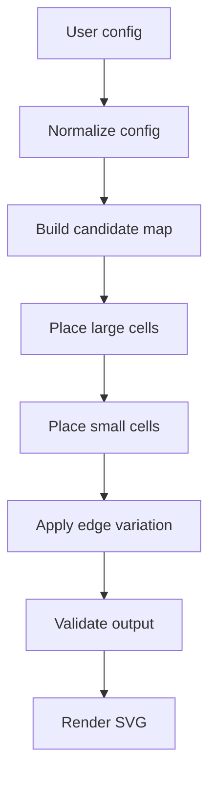
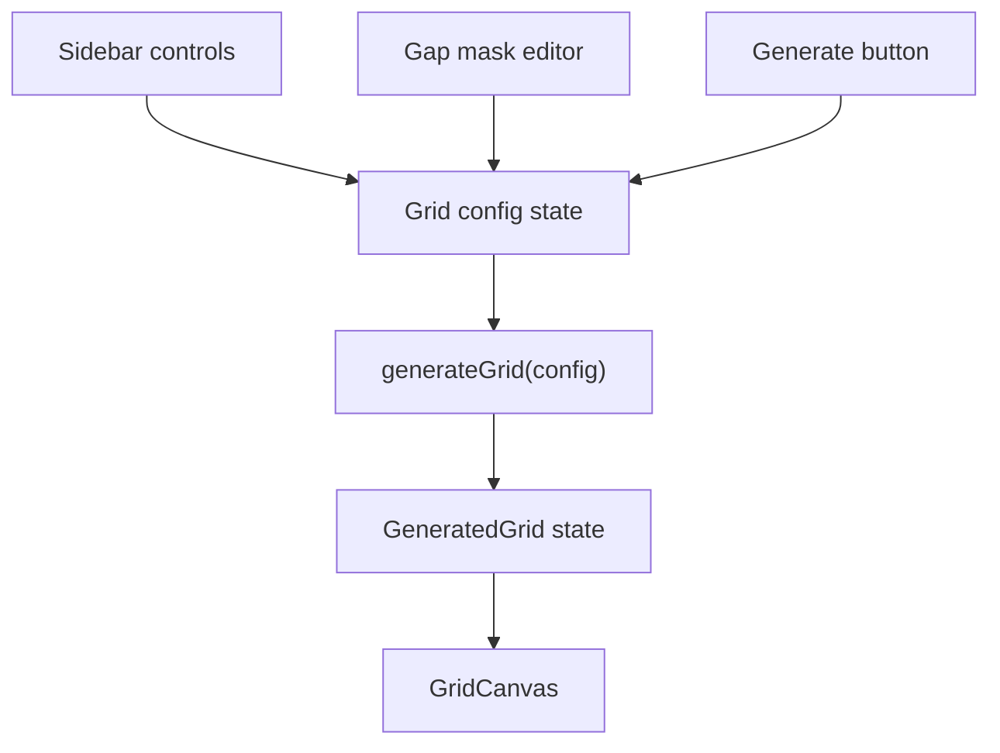

# Seeded Grid App Implementation Plan

> **Legacy (pre-Phase-0).** Describes the removed Section Grid Builder; retained for history, not current.

This plan describes how to build the app after the rule book is accepted. The rule book in `docs/grid-rulebook.md` is the source of truth for generation and rendering behavior.

## Recommended Stack

Use a small TypeScript web app with an SVG renderer. SVG is a good fit because each generated cell is already a rectangle with a stroked outline, and the `0.5px` render offset is easy to express precisely.

Recommended structure:

```txt
src/
  app/
    App.tsx
  styles/
    global.css
  grid/
    config.ts
    generator.ts
    mask.ts
    prng.ts
    renderer.tsx
    validate.ts
    types.ts
  components/
    Sidebar.tsx
    RatioControl.tsx
    GapMaskEditor.tsx
    GridCanvas.tsx
```

## Module Responsibilities

### `grid/types.ts`

Define shared types:

- `GridCellKind`
- `GridCell`
- `GapMask`
- `GridConfig`
- `NormalizedGridConfig`
- `GeneratedGrid`

Keep these types plain and serializable. The generator should not depend on React.

### `grid/config.ts`

Own config normalization:

- Round `width` and `height` to nearest multiples of `40`.
- Clamp ratios into the `0..1` range.
- Keep `smallCellRatio + largeCellRatio = 1`.
- Derive `logicalWidth`, `logicalHeight`, `renderWidth`, and `renderHeight`.
- Resize or remap the gap mask when canvas dimensions change.

### `grid/prng.ts`

Provide a small deterministic PRNG wrapper:

- Accept a string seed.
- Return deterministic floats and integer ranges.
- Avoid `Math.random()` inside generation.
- Keep implementation isolated so the PRNG can be replaced later.

### `grid/mask.ts`

Own gap-mask utilities:

- Convert between preview-grid coordinates and base-grid coordinates.
- Check whether a candidate footprint intersects blocked slots.
- Resize masks when normalized canvas dimensions change.
- Support paint and erase operations for drag editing.

### `grid/generator.ts`

Generate cell data only:

- Normalize input config.
- Build candidate footprints for `40x40` and `80x80` cells.
- Shuffle or weight candidates using the seeded PRNG.
- Place large cells first.
- Place small cells second.
- Reject candidates that collide, enter gaps, leave bounds, or fail visual consistency checks.
- Return `GeneratedGrid` with stable deterministic cell IDs.

Do not include rendering offsets in generated cell data.

### `grid/validate.ts`

Provide pure validation functions:

- Check all hard invariants from the rule book.
- Check deterministic output in tests.
- Report useful error messages for failed candidates and generated results.

### `components/GridCanvas.tsx`

Render the generated grid:

- Use a white background.
- Set SVG size to `renderWidth` and `renderHeight`.
- Draw every cell at `x + 0.5`, `y + 0.5`.
- Use `fill="none"`, `stroke="#F3F3F3"`, and `strokeWidth={1}`.
- Keep rendering stateless and driven entirely by `GeneratedGrid`.

### `components/Sidebar.tsx`

Own user controls:

- Seed input.
- Width input.
- Height input.
- Small-cell ratio input.
- Large-cell ratio input.
- Generate button.
- Gap-mask editor.

Any config update should trigger generation automatically. Ratio controls must update each other so their sum remains `1`.

### `components/GapMaskEditor.tsx`

Render a compact editable mask preview:

- Start with an `8x8` visual editor.
- Map editor cells to base-grid slots proportionally.
- Let users click and drag to paint blocked cells red.
- Support erase behavior, either by modifier key, right click, or a selected paint mode.
- Emit mask updates to the parent config.

## Generation Flow



## State Flow



## Testing Plan

Add focused tests around pure logic first:

- Config normalization rounds width and height to multiples of `40`.
- Render dimensions equal logical dimensions plus `1`.
- Ratio updates preserve a sum of `1`.
- Same seed and same config return identical cells.
- Different seeds usually return different cells.
- Generated cells never leave bounds.
- Generated cells never overlap.
- Generated cells never occupy gap-mask slots.
- Generated cells only use `40x40` and `80x80` sizes.
- SVG renderer applies `0.5px` offsets and `#F3F3F3` stroke.

## First Build Milestones

1. Scaffold the TypeScript app.
2. Add the pure grid types, config normalization, seeded PRNG, and validator.
3. Implement basic generation with one connected group of non-overlapping `40x40` and `80x80` cells.
4. Add SVG rendering with centered-stroke correction.
5. Add sidebar controls and auto-generation.
6. Add the gap-mask editor.
7. Add tests for generator invariants and rendering math.
8. Tune placement heuristics until the output resembles the reference style without copying it.

## Important Product Decisions To Confirm Before Coding

- Whether the `Generate` button should keep the current seed or create a new seed.
- Whether the gap editor should always be `8x8` visually or scale with the canvas aspect ratio.
- Whether a density control is needed in addition to the small/large ratio.
- Whether true overlay cells inside large cells are needed in version one. The rule book currently recommends against this for the first build.
